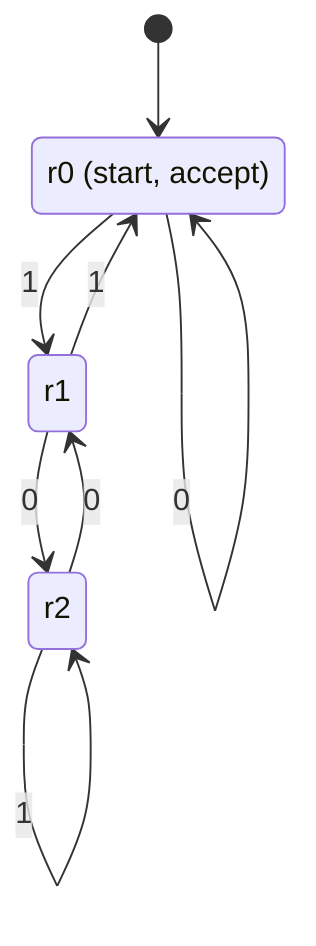
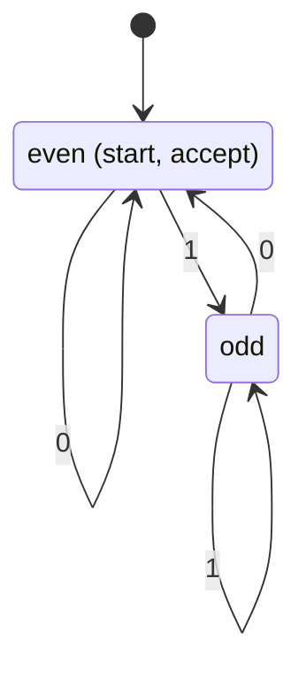

## Problem 1

Consider the finite automaton represented below. It accepts binary numbers divisible by three.

| Current state | Letter | Next state |
|---|---:|---|
| $r_0$ | 0 | $r_0$ |
| $r_0$ | 1 | $r_1$ |
| $r_1$ | 0 | $r_2$ |
| $r_1$ | 1 | $r_0$ |
| $r_2$ | 0 | $r_1$ |
| $r_2$ | 1 | $r_2$ |

It has three states $(r_0, r_1, r_2)$ and a two-letter alphabet $\{0,1\}$. The accepting state is $r_0$, which is also the initial state.

Implement this finite automaton in Halo2. Represent the transition function as tuples of the form *(current state, letter, next state)*, and use a lookup argument to verify that every transition in the trace appears in this table.

The prover must prove knowledge of a word that the automaton accepts.

Since the word length is unknown, introduce a **no-op** symbol and use it to pad the trace to the maximum allowed word length.

*Note: If you use the value **0** to represent state $r_0$, you will run into problems. Can you figure out why?*

## Problem 2 (challenge)

In the previous example, we built an automaton for one use with fixed states, symbols, and transitions.

Design a circuit for a generic automaton that can process any set of states, symbols, and transitions.

The transition function comes through the instance, so it can vary while staying public. The prover still creates the trace, but the lookup must now check advice columns instead of a `TableColumn`.

Halo2 cannot look up values against instance columns directly. First copy the transition function into three advice columns, then perform the lookup there.

Use `lookup_any` instead of `lookup`. It works in much the same way but needs flag columns to mark rows that belong to the lookup.

Use the same method for accepting states. Provide them through the instance, copy them into advice, then check the final state against them.

Test the circuit with this binary even/odd automaton:

| Current state | Letter | Next state |
|---|---:|---|
| even | 0 | even |
| even | 1 | odd |
| odd | 0 | even |
| odd | 1 | odd |
